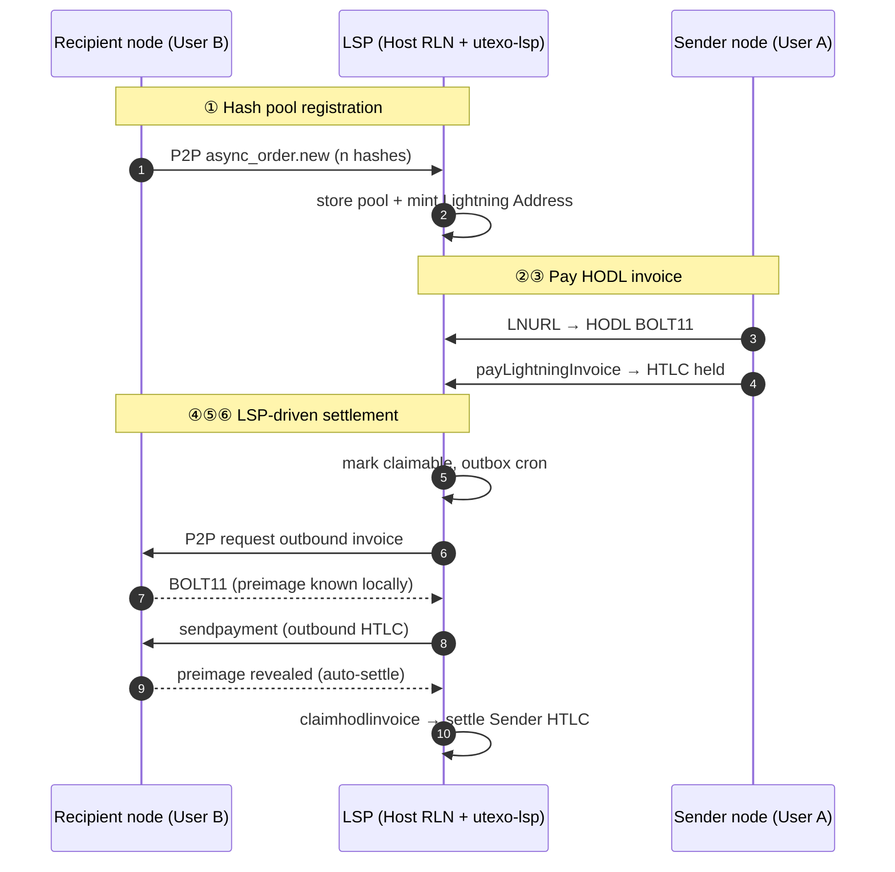

# Async Payment (APay) — Demo Reproduction Guide

Three logical nodes in the regtest demo:

| Node | What runs | Ports (regtest) |
|------|-----------|-----------------|
| **Recipient** | User B — `UTEXOWallet` in the app | random `40xxx` REST / LDK |
| **LSP** | Host RLN (`data_lsp`) + **utexo-lsp** (Go) | RLN `3005` / LDK `9737`, utexo-lsp `8080` |
| **Sender** | User A — `UTEXOWallet` in the app | random `42xxx` REST / LDK |

Demo screen: **LSP tab → Async Payment** (`screens/async-pay.tsx`).

Compare with the protocol-focused doc: [`apay-flow.md`](./apay-flow.md).

---

## Architecture



---

## Phase 0 — Prerequisites (before the 6 steps)

Run once:

```bash
# regtest stack (bitcoind, electrs, proxy) must already be up
./scripts/start-lsp-regtest.sh
```

This starts:

- **LSP Host RLN** with `--lsp-base-url`, `--lsp-bearer-token`, `--enable-virtual-channels-v0`
- **utexo-lsp** with `APAY_BEARER_TOKEN`, `DEFAULT_VIRTUAL_OPEN_MODE=trusted_no_broadcast`, `SUPPORTED_ASSET_IDS`
- Writes `EXPO_PUBLIC_LSP_REGTEST_*` to `.env.local`

Then run the app in **Release** (`npm run ios:release` / `android:release`).

**Channel setup (automatic):** both Sender and Recipient connect to the LSP peer; utexo-lsp cron opens a virtual RGB channel to each peer. Both app wallets need `enableVirtualChannelsV0: true` to match the LSP.

**RGB balance requirement:** Sender must have outbound RGB in its LSP channel to pay. Today utexo-lsp often opens channels with `push_asset_amount = 0` (all RGB on LSP side) — Sender payment fails until `DEFAULT_CHANNEL_PUSH_ASSET_AMOUNT` is fixed in utexo-lsp (see [Known blockers](#known-blockers) below).

---

## The 6 steps

### ① Recipient allocates N payment hashes to LSP

**Who:** Recipient node → LSP

**What happens:**

1. Recipient connects to LSP peer (`lsp.connect()`).
2. Recipient calls `wallet.apayNew(lspPubkey)`.
3. Recipient RLN generates N `(hash_index, payment_hash)` pairs and sends P2P `async_order.new` to Host RLN.
4. Host RLN forwards to utexo-lsp: `POST /internal/async_order/new` (bearer token).
5. utexo-lsp stores the hash pool and mints a Lightning Address for Recipient's pubkey.

**Demo (User B):**

```typescript
await lspB.connect();
const pool = await wB.apayNew(LSP_PEER_PUBKEY);
const addr = await lspB.http.getLightningAddressByPubkey(bPubkey);
// addr.username + addr.domain → e.g. "frosty-mountain@127.0.0.1:8080"
```

**Verify:** `pool.hashes.length > 0`, `pool.unusedHashes > 0`, Lightning Address returned.

---

### ② Sender requests Lightning Address from LSP

**Who:** Sender app → utexo-lsp (HTTP LNURL)

**What happens:**

1. Sender resolves `GET /.well-known/lnurlp/{username}`.
2. Sender calls callback: `GET /pay/callback/{username}?amount={msat}&asset_id=…&asset_amount=…`.
3. utexo-lsp reserves the next hash from Recipient's pool.
4. utexo-lsp asks Host RLN for a **HODL** inbound BOLT11 (`/lninvoice` with reserved `payment_hash`).
5. Sender receives `pr` (HODL BOLT11).

**Demo (User A):**

```typescript
const { pr } = await lspA.http.resolveAddress(
  username,
  3_000_000,   // PAYMENT_MSAT
  ASSET_ID,
  1,           // PAYMENT_ASSET_AMOUNT
);
```

**Verify:** non-empty `pr` (BOLT11 string).

---

### ③ Sender pays the invoice

**Who:** Sender node → LSP Host RLN

**What happens:**

1. Sender calls `wallet.payLightningInvoice({ lnInvoice: pr, assetId, assetAmount })`.
2. HTLC travels Sender → LSP over their RGB channel.
3. LSP **holds** the inbound HTLC (HODL — not settled yet).

**Demo (User A):**

```typescript
const payRes = await wA.payLightningInvoice({
  lnInvoice: pr,
  assetId: ASSET_ID,
  assetAmount: 1,
});
// expect status Pending (HTLC held at LSP), not Failed
```

**Verify:** `payRes.status` is `Pending` (not `Failed`).

---

### ④ HTLC is held at LSP

**Who:** LSP Host RLN + utexo-lsp (automatic)

**What happens:**

1. Host RLN detects held inbound HODL HTLC.
2. Host RLN notifies utexo-lsp: `POST /internal/async_order/claimable` (`payment_hash`, `amount_msat`, `claim_deadline_height`).
3. utexo-lsp marks invoice `claimable`.
4. Outbox enqueues `request_outbound_invoice`.

**Demo:** no app action. Recipient should **stay online** (peer connected to LSP) so step ⑤ can succeed via P2P.

**Verify (logs):** utexo-lsp outbox activity; invoice status `claimable` in DB.

---

### ⑤ LSP requests invoice from Recipient and pays it

**Who:** utexo-lsp → Host RLN → Recipient node (P2P) → back to LSP

**What happens:**

1. Outbox job `request_outbound_invoice`:
   - utexo-lsp → Host RLN: `POST /apay/outboundinvoice` (`client_node_id`, `hash_index`, `payment_hash`).
   - Host RLN → Recipient RLN: P2P `async_order.request_invoice`.
   - Recipient RLN replies with outbound BOLT11 (preimage already in hash pool).
2. Outbox job `send_outbound_payment`:
   - utexo-lsp → Host RLN: `POST /sendpayment` with Recipient's BOLT11.
   - HTLC LSP → Recipient; Recipient **auto-settles** using the known preimage.
3. Host RLN → utexo-lsp: `POST /internal/async_order/payment_sent` (`payment_hash`, `payment_preimage`).

**Demo:** Recipient does **not** manually call `claimHodlInvoice` in the real protocol — settlement is automatic from the hash pool. The app only needs to keep the peer connection alive (reconnect every ~15s if needed).

**Verify:**

- Recipient RGB balance increases (`getAssetBalance`).
- Sender payment eventually moves to `Succeeded`.

---

### ⑥ LSP claims payment from Sender

**Who:** utexo-lsp → Host RLN (automatic)

**What happens:**

1. Outbox job `claim_inbound_invoice` runs after `payment_sent`.
2. utexo-lsp → Host RLN: `POST /claimhodlinvoice` with preimage from step ⑤.
3. Host RLN settles the inbound HTLC from Sender (step ③).
4. Sender payment → `Succeeded`. utexo-lsp status → `inbound_claimed`.

**Demo (User A):**

```typescript
// Poll until Sender payment succeeds
const payments = await wA.listPaymentsRaw();
// outbound payment status → Succeeded
```

**Verify:** User A payment `Succeeded`; User B RGB `offchainInbound` increased.

---

## State machine (utexo-lsp)

```
active hash pool
  → claimable              (④ Sender HTLC held)
  → outbound_requested     (⑤a P2P invoice request sent)
  → outbound_pending       (⑤a Recipient replied with BOLT11)
  → outbound_paid          (⑤b LSP paid Recipient)
  → outbound_claimed       (⑤c preimage received via payment_sent)
  → inbound_claimed        (⑥ Sender HTLC settled) ✓
```

---

## What each demo role must do

| Role | App responsibility | SDK calls |
|------|-------------------|-----------|
| **Recipient (B)** | Register pool once; stay online during settlement | `apayNew`, `getLightningAddressByPubkey`, keep `connectPeer` alive |
| **Sender (A)** | LNURL + pay HODL invoice; wait for success | `resolveAddress`, `payLightningInvoice`, poll `listPaymentsRaw` |
| **LSP** | Fully automatic (cron + outbox) | — (configured in `start-lsp-regtest.sh`) |

---

## How to run the demo

```bash
# 1. Infrastructure
cd rgb-lightning-node && ./regtest.sh start
cd rgb-sdk-rn-demo && ./scripts/start-lsp-regtest.sh

# 2. App (Release build)
npm run ios:release   # or android:release

# 3. In app: LSP tab → Regtest → Async Payment → Run
```

**Android emulator** — port forwards (script sets these if device connected):

```bash
adb reverse tcp:3000 tcp:3000   # RGB proxy
adb reverse tcp:3005 tcp:3005   # LSP RLN
adb reverse tcp:8080 tcp:8080   # utexo-lsp
adb reverse tcp:5000 tcp:5000   # bitcoin bridge
```

---

## Success criteria

| Check | Expected |
|-------|----------|
| ① `apayNew` | Returns `orderId`, `hashes[]`, `unusedHashes > 0` |
| ② LNURL callback | Returns HODL BOLT11 in `pr` |
| ③ `payLightningInvoice` | `Pending` (not `Failed`) |
| ⑤ Recipient balance | RGB `offchainInbound` increases by `PAYMENT_ASSET_AMOUNT` |
| ⑥ Sender payment | Status `Succeeded` within ~90s |

---

## Known blockers (current demo)

1. **`push_asset_amount = 0` for Sender channel** — utexo-lsp listpeers fallback does not push RGB to the counterparty; Sender has 0 RGB → step ③ fails. Fix: add `DEFAULT_CHANNEL_PUSH_ASSET_AMOUNT` in utexo-lsp.

2. **`async-pay.tsx` Phase 4 (claim poll)** — current screen polls `InboundHodl/Claimable` and calls `claimHodlInvoice` manually. That does **not** match the real LSP-driven protocol (steps ⑤⑥ are automatic). Correct demo behavior: wait for Sender `Succeeded` + check Recipient RGB balance.

3. **Virtual channel mismatch** — if LSP runs without `--enable-virtual-channels-v0` but app wallets have it enabled, channels force-close with `unsupported_scid_alias`. Use current `start-lsp-regtest.sh` (virtual enabled on both sides).

---

## Mapping to the 6 steps

| # | Step | Demo phase | Driver |
|---|------|------------|--------|
| 1 | Recipient allocates hashes | `register` (User B) | Recipient app |
| 2 | Sender gets Lightning Address | `lnurlp` (User A) | Sender app |
| 3 | Sender pays invoice | `send` (User A) | Sender app |
| 4 | HTLC held at LSP | automatic after ③ | LSP |
| 5 | LSP requests + pays Recipient invoice | automatic outbox | LSP (+ Recipient online) |
| 6 | LSP claims Sender payment | automatic outbox | LSP |

---

## Relation to utexo-lsp tests (PR #14)

| Steps | Covered in utexo-lsp tests | Real RLN nodes? |
|-------|---------------------------|-----------------|
| ①② | `lightning_address_test.go`, `api_async_order_test.go` | No — DB + HTTP stubs |
| ④⑤⑥ | `claim_flow_test.go` (`TestOutboxWorkerCompletesClaimFlow`) | No — stub `/apay/outboundinvoice`, `/sendpayment`, `/claimhodlinvoice` |
| Full ①–⑥ | Not covered end-to-end | Demo app is the integration test |
