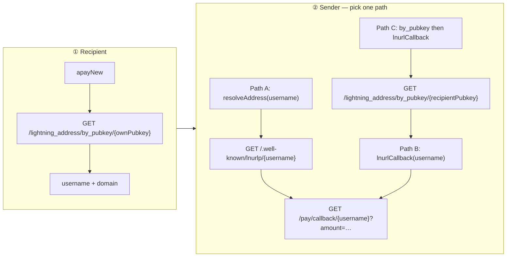

# APay Flow — Regular (On-Chain) RGB Channels

> Regular channels = standard LDK RGB channels with on-chain funding (no `trusted_no_broadcast` virtual mode).  
> Matches utexo-lsp e2e `test_flow0_full_e2e` style — **not** the current virtual-channel demo defaults.

Compare:

- Protocol internals: [`apay-flow.md`](./apay-flow.md)
- Virtual-channel demo runbook: [`apay-flow-demo-reproduction.md`](./apay-flow-demo-reproduction.md)

**Note:** The repo script is `scripts/start-lsp-regtest.sh`. If you use a local copy named `start-lsp-local.sh`, apply the same changes there.

---

## Three nodes

| Node | Process | Regtest ports |
|------|---------|---------------|
| **Recipient** (User B) | `UTEXOWallet` in app | random REST / LDK |
| **LSP** | Host RLN `data_lsp` + utexo-lsp | RLN `3005`, LDK `9737`, HTTP `8080` |
| **Sender** (User A) | `UTEXOWallet` in app | random REST / LDK |

APay protocol steps ④–⑥ are identical for virtual and regular channels. Only **channel open** differs.

---

## Lightning Address APIs (important)

utexo-lsp exposes **two different HTTP endpoints** for Lightning Address. They serve different roles.

### API map

| Endpoint | Who calls it | Input | Output | Purpose |
|----------|--------------|-------|--------|---------|
| `GET /lightning_address/by_pubkey/{pubkey}` | **Recipient app** (or demo shortcut) | Recipient secp pubkey (hex) | `{ username, domain }` | Look up the **haiku username** minted for that pubkey |
| `GET /.well-known/lnurlp/{username}` | **Sender app** (LUD-06) | Username only | `{ callback, metadata, minSendable, maxSendable, tag }` | Standard LNURL-pay discovery |
| `GET /pay/callback/{username}?amount=…` | **Sender app** | Username + amount (+ optional `asset_id`, `asset_amount`) | `{ pr, routes }` | Reserve hash slot → HODL BOLT11 |

**`by_pubkey` is not LNURL.** It does not return an invoice. It only resolves `pubkey → username + domain` after the account was created during `async_order.new`.

**Username is minted once** per pubkey when utexo-lsp handles `POST /internal/async_order/new` — it calls `ensureLightningAddressAccount(peer_pubkey)` before storing the hash pool.

### SDK wrappers (`rgb-sdk-rn`)

| SDK method | HTTP | When to use |
|------------|------|-------------|
| `lsp.http.getLightningAddressByPubkey(pubkey)` | `GET /lightning_address/by_pubkey/{pubkey}` | **Step ①** — Recipient after `apayNew`; demo can pass `username` to Sender |
| `lsp.http.resolveAddress(username, amtMsat, assetId?, assetAmount?)` | `GET /.well-known/lnurlp/{username}` **then** callback URL | **Step ②** — full LUD-06 path (production sender) |
| `lsp.http.lnurlCallback(username, amtMsat, …)` | `GET /pay/callback/{username}?…` only | **Step ② shortcut** — skip LNURL discovery when username is already known |
| `lsp.enableLightningAddress()` | `apayNew` + `getLightningAddressByPubkey` | **Step ①** one-shot on Recipient |

### Correct flow split



**Production sender** (only knows `alice@lsp.example.com`):

1. Parse `alice` from the address string.
2. `resolveAddress('alice', amtMsat, …)` — uses `/.well-known/lnurlp/alice`.

**Demo sender** (User A has User B's pubkey or username from the same app run):

```typescript
// Option A — full LNURL (same as production)
const { pr } = await lspA.http.resolveAddress(username, 3_000_000, ASSET_ID, 1);

// Option B — skip LNURL discovery (username already known from step ①)
const { pr } = await lspA.http.lnurlCallback(username, 3_000_000, ASSET_ID, 1);

// Option C — sender knows recipient pubkey but not username (demo shortcut)
const { username, domain } = await lspA.http.getLightningAddressByPubkey(recipientPubkey);
const { pr } = await lspA.http.lnurlCallback(username, 3_000_000, ASSET_ID, 1);
```

`resolveAddress` internally rewrites callback URLs for Android emulator (`10.0.2.2`) — prefer it on Android when using Path A.

---

## The 6 steps (regular channels)

### Phase 0 — Infrastructure + standard channels

**Start stack** (after `regtest.sh start`):

```bash
./scripts/start-lsp-regtest.sh   # or your start-lsp-local.sh with changes below
```

**Channel open (automatic):** utexo-lsp cron calls `/openchannel` on Host RLN when a peer connects and has no RGB channel. With regular channels:

- No `virtual_open_mode` in openchannel request
- Funding tx is broadcast → **mine blocks** while waiting (`onEachPoll: () => mine(1)` in SDK)
- Longer wait than virtual 0-conf, but no `enableVirtualChannelsV0` anywhere

---

### ① Recipient allocates N payment hashes to LSP

```
Recipient RLN ──P2P async_order.new──► Host RLN ──POST /internal/async_order/new──► utexo-lsp
                                                                                      └─ ensureLightningAddressAccount(pubkey)
                                                                                      └─ store hash pool
```

**Recipient app:**

```typescript
await lspB.connect();
await wB.apayNew(LSP_PEER_PUBKEY);

// Discover own Lightning Address (by_pubkey — NOT lnurlp)
const { username, domain } = await lspB.http.getLightningAddressByPubkey(bPubkey);
// share username with Sender (demo) or publish username@domain
```

**Verify:** `unusedHashes > 0`, `username` non-empty.

---

### ② Sender gets HODL BOLT11

**Not** `by_pubkey` on the sender unless using Path C above.

**Standard (Path A):**

```typescript
const { pr } = await lspA.http.resolveAddress(
  username,      // from step ①
  3_000_000,
  ASSET_ID,
  1,
);
```

Under the hood:

1. `GET http://{host}:8080/.well-known/lnurlp/{username}` → `callback` URL
2. `GET {callback}?amount=3000000&asset_id=…&asset_amount=1`
3. utexo-lsp reserves next hash from pool, calls Host RLN `/lninvoice` (HODL) → returns `pr`

---

### ③ Sender pays the invoice

```typescript
const payRes = await wA.payLightningInvoice({
  lnInvoice: pr,
  assetId: ASSET_ID,
  assetAmount: 1,
});
```

HTLC travels over **regular** Sender↔LSP RGB channel. Sender needs **local RGB balance** (`push_asset_amount` on channel open).

**Verify:** `payRes.status === 'Pending'` (not `Failed`).

---

### ④ HTLC held at LSP

Automatic:

- Host RLN → `POST /internal/async_order/claimable`
- utexo-lsp → status `claimable`, outbox `request_outbound_invoice`

Recipient stays **online** (peer connected) for step ⑤.

---

### ⑤ LSP requests outbound invoice from Recipient and pays

Automatic outbox (same as virtual):

1. `POST /apay/outboundinvoice` → P2P `async_order.request_invoice` → Recipient BOLT11
2. `POST /sendpayment` → HTLC LSP → Recipient
3. Recipient auto-settles (preimage from hash pool)
4. `POST /internal/async_order/payment_sent` with preimage

**No** `claimHodlInvoice` on Recipient in the real protocol.

---

### ⑥ LSP claims Sender's inbound HTLC

Automatic outbox:

- `POST /claimhodlinvoice` on Host RLN with preimage from ⑤
- Sender payment → `Succeeded`

**Demo verify:**

```typescript
// Sender: poll until Succeeded
const payments = await wA.listPaymentsRaw();

// Recipient: RGB balance up
const bal = await wB.getAssetBalance(ASSET_ID);
```

---

## Changes needed: `start-lsp-regtest.sh` (your `start-lsp-local.sh`)

Current script enables **virtual** channels. For **regular** channels:

### 1. LSP Host RLN — remove virtual flag

```diff
 "$RLN_BIN" "$LSP_DIR" \
   --daemon-listening-port "$LSP_PORT" \
   --ldk-peer-listening-port "$LSP_PEER_PORT" \
   --network regtest \
   --disable-authentication \
-  --enable-virtual-channels-v0 \
   --lsp-base-url "http://127.0.0.1:$UTEXO_PORT" \
   --lsp-bearer-token "$APAY_BEARER_TOKEN" \
```

### 2. utexo-lsp env — remove virtual open mode; fix RGB push

```diff
 env \
   LSP_BASE_URL="http://127.0.0.1:$LSP_PORT" \
   RGB_NODE_BASE_URL="http://127.0.0.1:$LSP_PORT" \
   LIGHTNING_ADDRESS_DOMAIN_URL="http://127.0.0.1:$UTEXO_PORT" \
   SUPPORTED_ASSET_IDS="$ASSET_ID" \
   CRON_EVERY="5s" \
   DEFAULT_CHANNEL_CAPACITY_SAT="200000" \
   DEFAULT_CHANNEL_PUSH_MSAT="5000000" \
-  DEFAULT_CHANNEL_ASSET_AMOUNT="1" \
-  DEFAULT_VIRTUAL_OPEN_MODE="trusted_no_broadcast" \
+  DEFAULT_CHANNEL_ASSET_AMOUNT="2" \
+  DEFAULT_CHANNEL_PUSH_ASSET_AMOUNT="1" \
   MIN_AMT_MSAT="3000000" \
   APAY_BEARER_TOKEN="$APAY_BEARER_TOKEN" \
```

`DEFAULT_CHANNEL_PUSH_ASSET_AMOUNT` **does not exist yet** in utexo-lsp — see [utexo-lsp changes](#changes-needed-utexo-lsp) below. Until implemented, Sender still gets `push_asset_amount=0`.

### 3. Seed more RGB on LSP

With `asset_amount=2` and `push=1` per channel, LSP needs more seeded RGB:

```diff
-log "Seeding LSP with 3 RGB units from Faucet …"
-for i in 1 2 3; do
+log "Seeding LSP with 6 RGB units from Faucet …"
+for i in 1 2 3 4 5 6; do
```

(Or keep 3 seeds if `asset_amount=1` and only fix push for Sender in utexo-lsp source.)

### 4. Keep unchanged (APay-required)

These must stay for async payments:

| Setting | Value |
|---------|-------|
| `--lsp-base-url` | `http://127.0.0.1:8080` |
| `--lsp-bearer-token` | same as `APAY_BEARER_TOKEN` |
| `APAY_BEARER_TOKEN` | non-empty, matching on LSP RLN + utexo-lsp |
| `LIGHTNING_ADDRESS_DOMAIN_URL` | `http://127.0.0.1:8080` |
| `SUPPORTED_ASSET_IDS` | issued asset ID |
| `adb reverse tcp:3000` | RGB proxy (critical for channel open) |

---

## Changes needed: `screens/async-pay.tsx`

### 1. Remove virtual channels from wallets

```diff
 const wB = new UTEXOWallet({
   {
     storageDirPath: dirB.replace('file://', ''),
     ...
     network: 'regtest',
     maxMediaUploadSizeMb: 20,
-    enableVirtualChannelsV0: true,
   },
   new PasswordRLNSigner('apaypassB', keysB.mnemonic),
 );
```

Same for User A wallet.

### 2. Mine while waiting for channels

Regular channels need block confirmations:

```typescript
const chanB = await lspB.waitForChannel(ASSET_ID, {
  timeoutMs: CHANNEL_TIMEOUT_S * 1000,
  pollIntervalMs: 3_000,
  onEachPoll: () => mine(1),   // required for regtest
});
```

### 3. Step ① — use `by_pubkey` on Recipient (already correct)

```typescript
const pool = await wB.apayNew(LSP_PEER_PUBKEY);
const lnaddr = await lspB.http.getLightningAddressByPubkey(bPubkey);
// pass lnaddr.username to step ②
```

### 4. Step ② — Sender uses `resolveAddress` or `lnurlCallback`

```typescript
// Production-like (full LNURL):
const callbackData = await lspA.http.resolveAddress(
  lnaddr.username, PAYMENT_MSAT, ASSET_ID, PAYMENT_ASSET_AMOUNT,
);

// Or demo shortcut (username already known):
// const callbackData = await lspA.http.lnurlCallback(
//   lnaddr.username, PAYMENT_MSAT, ASSET_ID, PAYMENT_ASSET_AMOUNT,
// );
```

Do **not** call `getLightningAddressByPubkey` on Sender unless using Path C (pubkey-only shortcut).

### 5. Replace claim phase (steps ⑤⑥ are LSP-driven)

**Remove:** poll `InboundHodl/Claimable` + `claimHodlInvoice`.

**Add:**

```typescript
// Wait for Sender payment Succeeded
// Check Recipient RGB balance increased
```

---

## Changes needed: utexo-lsp

### `DEFAULT_CHANNEL_PUSH_ASSET_AMOUNT` (required for Sender RGB)

`listpeers` fallback never sets `AssetDecimals` → `push_asset_amount` stays 0.

Add to `internal/lspapi/config.go` + `api.go` `openChannelRequest()`:

```go
// When AssetDecimals is nil, use config push amount for RGB channels
if inbound == 0 && c.AssetID != nil && a.cfg.DefaultChannelPushAssetAmount != nil {
    inbound = *a.cfg.DefaultChannelPushAssetAmount
}
```

Without this, step ③ fails on regular **and** virtual channels.

### No APay code changes for regular vs virtual

`async_order.go`, `lightning_address.go`, outbox jobs — **channel-type agnostic**.

---

## Changes needed: `rgb-sdk-rn`

No SDK code changes required. Use existing APIs correctly:

| Step | API |
|------|-----|
| ① Register + get own address | `apayNew` + `getLightningAddressByPubkey` or `enableLightningAddress()` |
| ② Get invoice | `resolveAddress` (LNURL) or `lnurlCallback` (shortcut) |
| ③ Pay | `payLightningInvoice` |
| ⑥ Verify | `listPaymentsRaw` (Sender), `getAssetBalance` (Recipient) |

Optional wallet params for regular channels:

```typescript
new UTEXOWallet({
  // ...
  // omit enableVirtualChannelsV0 (default false)
  lspBaseUrl: LSP_URL,           // recommended per SDK docs
  lspBearerToken: 'apay-regtest-secret',  // if wallet-native APay paths used
}, signer);
```

Demo currently passes `LspPeer` explicitly to `createLsp()` — `lspBaseUrl` on wallet is optional for HTTP-only flows but required for native `apayNew` P2P routing in some setups.

---

## Run checklist (regular channels)

```bash
cd rgb-lightning-node && ./regtest.sh start
cd rgb-sdk-rn-demo && ./scripts/start-lsp-regtest.sh   # with regular-channel edits
npm run ios:release   # or android:release — not Debug
```

| Step | Action | Pass criteria |
|------|--------|---------------|
| 0 | Both users connect + `mine(1)` during `waitForChannel` | `is_usable` RGB channel, no `unsupported_scid_alias` |
| ① | User B: `apayNew` + `getLightningAddressByPubkey` | `username`, `unusedHashes > 0` |
| ② | User A: `resolveAddress(username, …)` | non-empty `pr` |
| ③ | User A: `payLightningInvoice` | `Pending` |
| ④–⑥ | Wait; User B stays connected | User A → `Succeeded`; User B RGB up |

---

## Regular vs virtual (demo)

| | Regular channels | Virtual channels (current script) |
|--|------------------|-----------------------------------|
| LSP RLN flag | omit `--enable-virtual-channels-v0` | `--enable-virtual-channels-v0` |
| utexo-lsp | omit `DEFAULT_VIRTUAL_OPEN_MODE` | `trusted_no_broadcast` |
| App wallets | omit `enableVirtualChannelsV0` | `enableVirtualChannelsV0: true` |
| Channel ready | after mine + confirms | immediate (0-conf) |
| APay steps ①–⑥ | **identical** | **identical** |
| LNURL / by_pubkey | **identical** | **identical** |

Virtual channels are a **regtest convenience**, not an APay protocol requirement.
