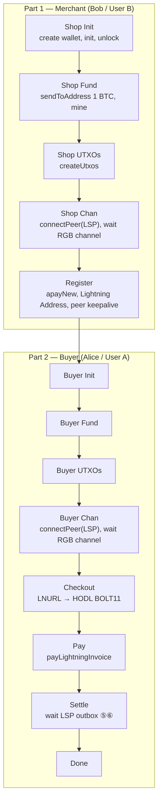
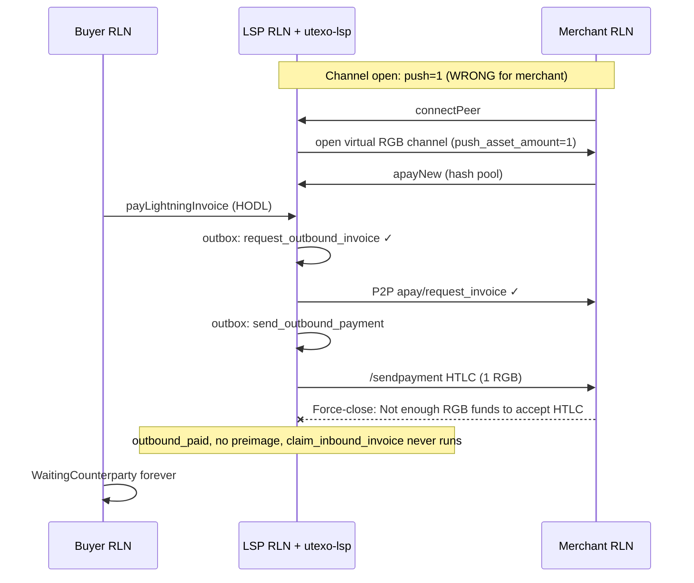
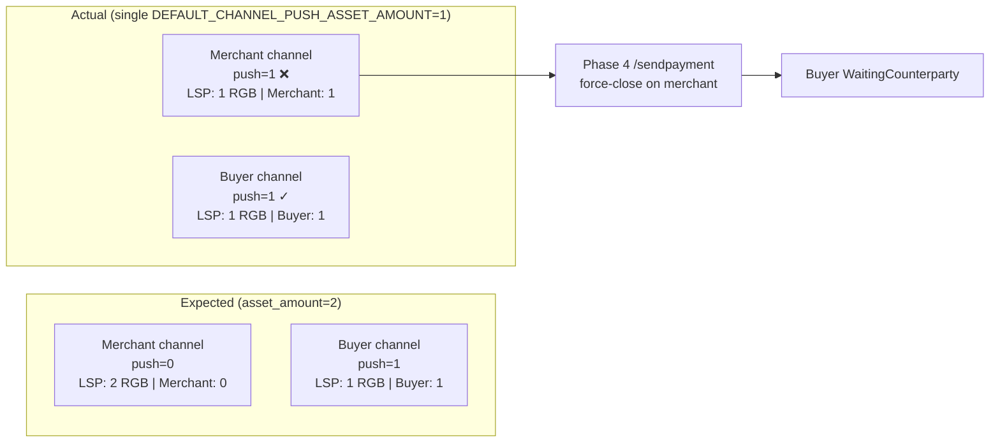

# Bug report: APay cart checkout stalls — LSP opens identical RGB channel economics for merchant and buyer

**Component:** `utexo-lsp` — `reconcileChannels()` / `openChannelRequest()`  
**Severity:** High — APay LNURL cart checkout cannot complete end-to-end  
**Affects:** Virtual RGB APay flow with two app peers (merchant/recipient + buyer/sender)  
**Demo repro:** `rgb-sdk-rn-demo` → `screens/apay-regular-channels.tsx` + `scripts/start-lsp-local.sh`

---

## Summary

When `DEFAULT_CHANNEL_PUSH_ASSET_AMOUNT=1` is set (required so the **buyer** can send RGB), the **merchant** virtual RGB channel is opened with `push_asset_amount=1`. During APay settlement (Phase 4), the LSP’s `/sendpayment` toward the merchant triggers a **force-close** with *"Not enough RGB funds to accept this HTLC"*. The APay outbox never reaches `claim_inbound_invoice`; the buyer stays on `WaitingCounterparty` indefinitely.

The root issue is that **utexo-lsp applies one global `push_asset_amount` to every auto-opened channel**, while APay needs **opposite channel economics** for the two peer roles.

---

## Demo flow (APay Cart Checkout screen)

**Screen:** `screens/apay-regular-channels.tsx`  
**Prerequisite:** `./scripts/start-lsp-local.sh` (virtual LSP + utexo-lsp on regtest)

### Scenario card (as shown in the app)

This flow models an RGB shop checkout with async delivery:

**🛒 Cart — Customer (Alice / User A) buys:**

- `1× RGB Token (UTST)`
- Total: **3000 sat** + **1 RGB unit**

**🏪 Merchant (Bob / User B):**

- Opens a virtual RGB channel (`trusted_no_broadcast`) with the LSP.
- Calls `apayNew` → `GET /lightning_address/by_pubkey` to get shop address (e.g. `brisk-river-0421@127.0.0.1:8080`).
- Node keeps P2P to LSP (required for APay outbox).

**💳 Checkout — Customer:**

- `GET /.well-known/lnurlp/{username}` → callback → HODL BOLT11
- Pays invoice. LSP holds HODL HTLC.

**📦 Delivery — LSP automatic (steps ⑤⑥):**

- LSP outbox requests outbound invoice, pays merchant, claims buyer HTLC.
- **No** `claimHodlInvoice` on merchant.

### Config shown on the demo card

| Parameter | Value |
|-----------|-------|
| Channels | virtual `trusted_no_broadcast` |
| LSP API | `http://127.0.0.1:8080` (Android emulator: `10.0.2.2:8080`) |
| Asset ID | from `.env.local` / `EXPO_PUBLIC_LSP_REGTEST_ASSET_ID` |
| Checkout | 3000 sat + 1 RGB |

### UI phase steps (execution order)

The app runs **merchant first**, then **buyer** (merchant channel opens before `apayNew`).



| Phase | Label | What the app does |
|-------|-------|-------------------|
| `b_init` | Shop Init | Create merchant `UTEXOWallet`, `createLsp`, `init`, `unlock` |
| `b_fund` | Shop Fund | `sendToAddress` 1 BTC, mine 6, `syncWallet` |
| `b_utxos` | Shop UTXOs | `createUtxos`, mine 1 |
| `b_channel` | Shop Chan | `lspB.connect()` → LSP cron opens virtual RGB channel → `waitForChannel` |
| `register` | Register | `apayNew`, `lightningAddressByPubkey`, start merchant `connectPeer` keepalive (15s) |
| `a_init` | Buyer Init | Create buyer wallet, init, unlock |
| `a_fund` | Buyer Fund | `sendToAddress` 1 BTC, mine 6 |
| `a_utxos` | Buyer UTXOs | `createUtxos`, mine 1 |
| `a_channel` | Buyer Chan | `lspA.connect()` → second RGB channel → `waitForChannel` |
| `lnurlp` | Checkout | `GET /.well-known/lnurlp/{username}` + callback with cart + RGB amount |
| `send` | Pay | Merchant reconnect, `payLightningInvoice` (HODL) → `PENDING` |
| `settle` | Settle | Poll buyer payment until `Settled`; verify merchant RGB balance increased |
| `done` | Done | Cart checkout complete |

**Where the bug surfaces:** during `settle` — buyer stays `WaitingCounterparty` because LSP never reaches `claim_inbound_invoice` after merchant channel force-close on step ⑤ (`send_outbound_payment`).

---

## Expected behavior (APay protocol)

APay settlement is asymmetric:

| Peer role | Channel need | Why |
|-----------|--------------|-----|
| **Merchant / Recipient** | `push_asset_amount = 0` | LSP holds RGB and pays **inbound** to merchant via `/sendpayment` (Phase 4). Merchant auto-settles with preimage from hash pool. |
| **Buyer / Sender** | `push_asset_amount ≥ 1` | Buyer must have **local RGB** to pay the HODL BOLT11 via `payLightningInvoice` (Phase 2). |

With `DEFAULT_CHANNEL_ASSET_AMOUNT=2`:

- Merchant channel: `asset_amount=2`, `push=0` → LSP local=2, merchant local=0 → LSP can forward 1 RGB inbound.
- Buyer channel: `asset_amount=2`, `push=1` → LSP local=1, buyer local=1 → buyer can send 1 RGB.

Full happy path:

```
initial → claimable → outbound_requested → outbound_pending → outbound_paid
  → outbound_claimed → inbound_claimed
```

Buyer payment status: `PENDING` → `Succeeded`.

---

## Actual behavior

With `DEFAULT_CHANNEL_PUSH_ASSET_AMOUNT=1` for **all** peers:

1. Merchant connects first → LSP cron opens virtual RGB channel with `push_asset_amount=1`.
2. Merchant registers via `apayNew` → Lightning Address created ✓
3. Buyer connects → second channel opens with `push_asset_amount=1` ✓
4. Buyer pays HODL invoice → status `PENDING` ✓
5. LSP outbox runs `request_outbound_invoice` → **done** ✓
6. LSP outbox runs `send_outbound_payment` → **done** (HTTP 200, optimistic) ✓
7. **Merchant channel force-closes** ~4s after buyer pay ✗
8. `claim_inbound_invoice` **never created** ✗
9. Invoice stuck at `outbound_paid` (no preimage) ✗
10. Buyer polls `getLightningSendRequest` → **`WaitingCounterparty` forever** ✗

Restarting LSP / app does not help — channel opens with the same economics every run.

---

## Architecture diagram (failure point)



### Channel economics (expected vs actual)



---

## Reproduction

### Prerequisites

- Regtest stack: Bitcoin Core, Electrum, RGB Proxy, `local-node-bridge` (port 5000)
- `./scripts/start-lsp-local.sh` with:

```bash
DEFAULT_CHANNEL_ASSET_AMOUNT="2"
DEFAULT_CHANNEL_PUSH_ASSET_AMOUNT="1"
DEFAULT_VIRTUAL_OPEN_MODE="trusted_no_broadcast"
```

- LSP seeded with ≥6 RGB units of test asset
- Android emulator: `adb reverse` for 3000, 3005, 8080, 5000, 8081, 8082
- Demo app Release build → **APay Regular Channels** screen → Run full flow

### Flow order (important)

```
1. Merchant: init → fund → createUtxos → connectPeer(LSP) → wait channel usable
2. Merchant: apayNew(LSP pubkey) → Lightning Address registered
3. Buyer:    init → fund → createUtxos → connectPeer(LSP) → wait channel usable
4. Buyer:    LNURL checkout → payLightningInvoice(HODL BOLT11)
5. Wait for settlement
```

**Note:** Merchant channel opens at step 1, **before** `apayNew` at step 2.

### Alternate repro showing sender-side failure

Set `DEFAULT_CHANNEL_PUSH_ASSET_AMOUNT=0` (or unset):

- Merchant settlement may work
- Buyer `payLightningInvoice` → **`FAILED`** immediately (0 local RGB)

This confirms **one global push value cannot satisfy both roles**.

---

## Evidence

### Symptom in demo app logs

```
← buyer.payLightningInvoice  status="PENDING"
Cart paid — LSP holds HODL HTLC; waiting for LSP outbox settlement…
buyer payment status: WaitingCounterparty   (repeats forever)
```

`WaitingCounterparty` here is the SDK mapping of Lightning send `PENDING` via `getLightningSendRequest()` — **not** RGB `listtransfers` status.

### `utexo_lsp.db` (async_rotating_invoices + outbox)

After stall:

| Field / job | Value |
|-------------|-------|
| Invoice `status` | `outbound_paid` |
| `payment_preimage` | NULL |
| Outbox `request_outbound_invoice` | done |
| Outbox `send_outbound_payment` | done |
| Outbox `claim_inbound_invoice` | **never created** |

Example payment hashes observed: `6648e8a1…`, `21f09f4f…`, `15fbac92…` (same pattern across restarts).

### LSP RLN log (`data_lsp/logs/rln-lsp.log`)

Typical sequence:

```
EVENT: received payment from payment hash <hash>     # PaymentClaimable — buyer HTLC held ✓
POST /apay/outboundinvoice → 200
POST /sendpayment → 200                              # returns quickly; no PaymentSent follow-up
```

Then on **merchant** channel:

```
CounterpartyForceClosed: "Not enough RGB funds to accept this HTLC"
```

After force-close:

- `listchannels`: only **buyer** channel remains; merchant channel gone
- Cron spam: `openchannel failed … virtual channel session already exists`
- Merchant peer may still appear in `listpeers` with 0 channels

### What does **not** cause this (ruled out)

- Merchant peer disconnect / keepalive — merchant reconnect succeeds; failure is channel economics, not P2P reachability for Phase 3
- RGB consignment / proxy delivery — channel opens and is RGB-usable before pay; APay outbox steps ⑤⑥ do run
- Empty APay outbox — outbox **does** advance to `send_outbound_payment=done`
- Restart alone — same channel params recreated

---

## Root cause (design gap)

### 1. Single global push for all peers

`reconcileChannels()` calls `openChannelRequest()` which applies `DEFAULT_CHANNEL_PUSH_ASSET_AMOUNT` uniformly.

**File:** `utexo-lsp/internal/lspapi/api.go` — `openChannelRequest()`, `getConnections()`

### 2. `/listconnections` unavailable → uniform synthesis

Cron calls `GET /listconnections` on LSP RLN → **404 Not Found**.  
Falls back to `GET /listpeers` and synthesizes identical `Connection` objects per peer (same `asset_amount`, same implied push). No per-peer `openchannel_params`.

**File:** `utexo-lsp/internal/lspapi/api.go` — `getConnections()` ~L1188–1235

`Connection` type supports `openchannel_params` (`pkg/node_client/node_endpoints.go`), but nothing populates role-specific values in the listpeers fallback.

### 3. Merchant role unknown at channel-open time

Merchant virtual channel opens on first `connectPeer` + cron tick, **before** `apayNew` creates `async_orders` row. A fix that only checks `async_orders` at open time would still open merchant with wrong push unless channel open is deferred or updated after registration.

### 4. Why `push=1` breaks merchant specifically

With `asset_amount=2`, `push_asset_amount=1`:

- LSP local RGB = 1, merchant local RGB = 1 at open
- Phase 4: LSP tries to deliver **another** 1 RGB inbound HTLC to merchant
- Merchant node rejects → force-close → LSP loses merchant channel → cannot complete settlement → buyer stuck `WaitingCounterparty`

Phase 3 (P2P `apay/request_invoice`) can succeed; failure is in **Phase 4** (`/sendpayment`).

---

## Suggested fixes (for dev team)

### Option A — Role-aware push in `openChannelRequest` (recommended)

When opening a virtual RGB channel:

- If peer has active `async_order` (APay merchant) → `push_asset_amount = 0`
- Else if peer is payment sender → `push_asset_amount = DEFAULT_CHANNEL_PUSH_ASSET_AMOUNT`

**Also required:** defer merchant channel open until after `apayNew`, **or** re-open / update channel policy when async order is created (today channel already exists).

### Option B — Connection-order heuristic (demo-grade)

In virtual mode only: if LSP has **no** existing RGB channel for asset → `push=0` (first peer = merchant); else → `push=default` (buyer).  
Works when merchant always connects first; fragile for production.

### Option C — Per-peer `openchannel_params` (proper long-term)

Implement RLN `GET /listconnections` so each peer registers intent at connect time (merchant `push: 0`, buyer `push: 1`). utexo-lsp already unmarshals `OpenChannelParams` when present.

### Option D — Config split (still needs logic)

```bash
DEFAULT_CHANNEL_PUSH_ASSET_AMOUNT=1           # senders
DEFAULT_CHANNEL_PUSH_ASSET_AMOUNT_FIRST=0   # first RGB channel / recipients
```

### Hardening

- Do not mark invoice `outbound_paid` until LSP RLN reports `PaymentSent` with preimage
- Cron: skip `openchannel` when virtual session already exists for peer (noise only)

---

## Impact

- **APay LNURL cart checkout** (LSP-driven automatic settlement) is broken with the push config needed for RGB senders
- **Manual Async Payment** (`claimHodlInvoice` on merchant) may still work — different code path, not representative of production APay
- Any deployment with auto channel open + APay merchants + RGB senders hits the same asymmetry

---

## References

| Item | Location |
|------|----------|
| APay flow doc | `docs/apay-flow.md` |
| Sender push=0 bug | `docs/bug-apay-zero-push-asset.md` |
| Demo screen | `screens/apay-regular-channels.tsx` |
| LSP startup config | `scripts/start-lsp-local.sh` |
| Channel open logic | `utexo-lsp/internal/lspapi/api.go` — `reconcileChannels`, `getConnections`, `openChannelRequest` |
| Config | `utexo-lsp/internal/lspapi/config.go` — `DefaultChannelPushAssetAmount` |

---

## Ticket one-liner

> **Title:** APay settlement stalls: `openChannelRequest` uses same `push_asset_amount` for merchant and buyer  
> **Body:** With `DEFAULT_CHANNEL_PUSH_ASSET_AMOUNT=1`, merchant channel gets push=1; LSP `/sendpayment` force-closes merchant with "Not enough RGB funds to accept this HTLC"; buyer stuck `WaitingCounterparty`. Need role-aware push (merchant push=0, buyer push=1) or per-peer `openchannel_params` via `/listconnections`.
